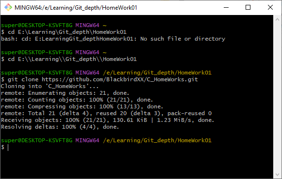
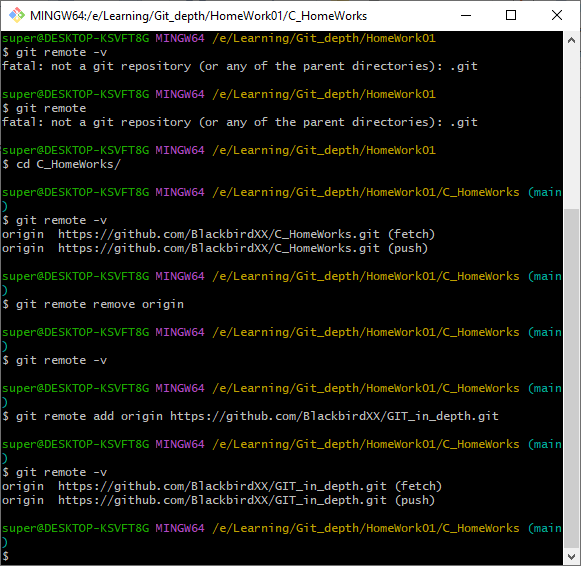
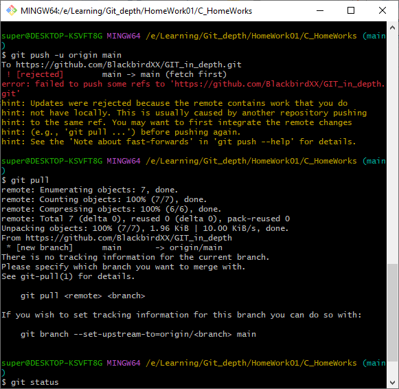
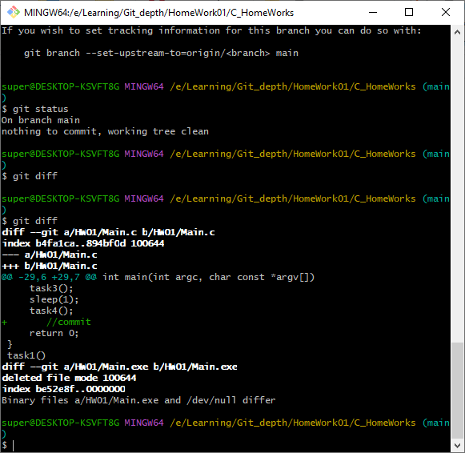
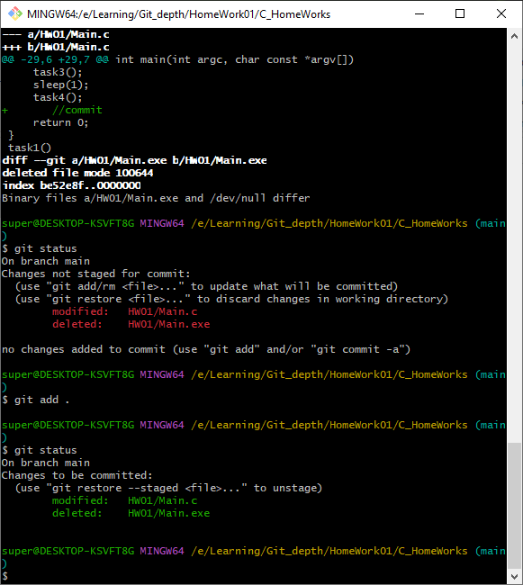
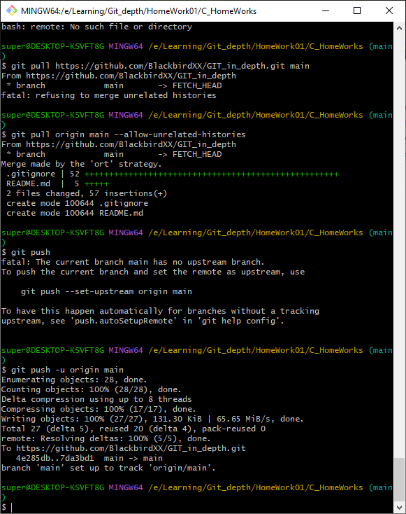

# GIT_in_depth

1. Выберите какой-нибудь проект на изучаемом вами языке программирования, с которым вы будете тренироваться работать в Git, и инициализируйте в папке этого проекта локальный репозиторий.
2. Создайте непустой удалённый репозиторий (например, с файлом README.md) с именем, соответствующим имени этого проекта.
3. Подключите свой проект к этому удалённому репозиторию и отправьте в него код этого проекта. Самостоятельно разрешите конфликты и проблемы, если они возникнут при выполнении данного задания.

Выполнял работу в оболочке GitBash и NotePad++. Возможно при использовании VSCode было бы проще.

### Клон удаленного репозитория по языку Си.

### Отключение локального репозитория от удаленного и подключение к новому удаленному.

### Получаем ошибку

### Изменения в локальном репозитории

### Успешное объединение двух репозиториев (не без танцев с бубном)
