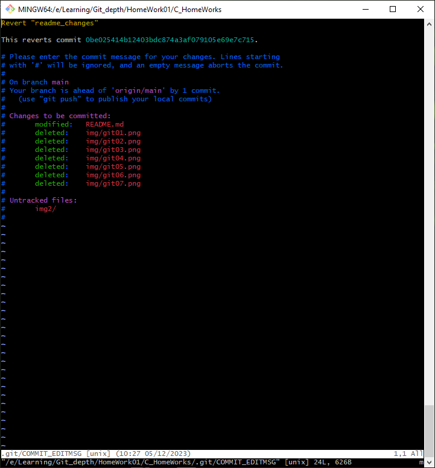

# GIT_in_depth

Данное домашнее задание является продолжением домашнего задания, которое вы выполняли на предыдущем семинаре в репозитории с собственным проектом.

1. Просмотрите историю коммитов в своём проекте и выберите три случайных коммита. Просмотрите изменения, которые были в них сделаны.

2. Верните эти изменения командой git revert последовательно, чтобы в итоге получилось тоже три коммита.

3. Попробуйте отменить эти три коммита:
* последний — командами git reset --soft и git restore;
* предпоследний — командой git reset --mixed и git restore;
* первый — командой git reset --hard.

### История коммитов (git log) и сравнение изменений в них (git diff).

### Команда git revert плюс коммиты в редакторе vim.

### Команда git reset --soft

### Команда git reset --mixed

### Команда git reset --hard
